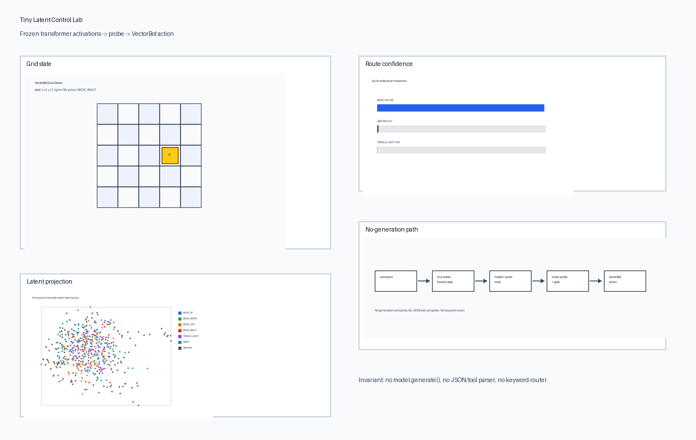
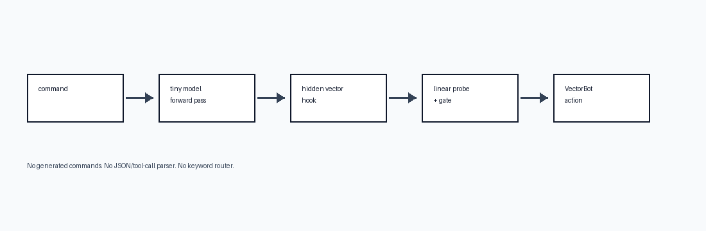

# Tiny Latent Control Lab (VectorBot)

I wanted to see if a tiny frozen language model could drive a toy app **without generating any text** — just use the hidden state as a signal and route it to a typed action.

A forward pass + hook grabs a vector. A small probe maps that vector to an action enum. A dumb kernel moves a bot on a 5×5 grid. No `model.generate()`, no JSON tool calls, no keyword if/else on the action path.



Learning / research demo. Not production safety.

## Actions

| Label | What it does |
|-------|----------------|
| `MOVE_UP` / `DOWN` / `LEFT` / `RIGHT` | Step on the grid |
| `TOGGLE_LIGHT` | Flip the bot light |
| `RESET` | Board back to start |
| `ABSTAIN` | Refuse junk / unsafe / compound / out-of-scope |

Examples: `go north` → move up · `what’s the weather?` → abstain · `delete all files` → abstain.

```text
text → tokenizer → frozen LM → hook (pre-lm_head)
    → vector → linear probe + OOD gate → enum → kernel
```



## Results (distilgpt2, CPU)

| Metric | Value |
|--------|------:|
| Test accuracy | 0.793 |
| Macro F1 | 0.698 |
| ABSTAIN P / R | 0.964 / 0.964 |

See `artifacts/vectorbot_metrics_full.json` and [docs/DEMO_RESULTS.md](docs/DEMO_RESULTS.md).

## Setup

```bash
python -m pip install -e ".[dev,llm,viz]"
python scripts/vectorbot_quickstart.py --model-id distilgpt2 --seed 42
```

Interactive:

```bash
streamlit run streamlit_app.py
# or
python -m gradio gradio_app
```

Optional analysis:

```bash
python scripts/analyze_concept_vectors.py
```

## Layout

| Path | What |
|------|------|
| `neural_native/vectorbot/` | grid state + kernel |
| `neural_native/llm/` | loaders + hooks (no generation) |
| `neural_native/bridge/` | probe router |
| `docs/adr/` | why zero-gen / which activation |
| `docs/safety.md` | safety notes |
| `gradio_app.py` / `streamlit_app.py` | demos |

## Honest limits

- Toy command space, not general tool use.  
- Not a claim that latent routing beats every text classifier.  
- Not production sandboxing.

Design notes: [architecture](docs/architecture.md) · ADRs in `docs/adr/`.

If the approach is dumb, say so — I’d rather hear it.
