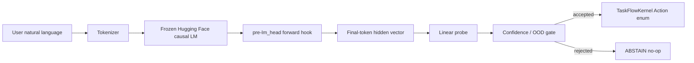

# Neural-Native Software: A Zero-API Paradigm

Portfolio-grade Python MVP that routes natural language to software actions by
intercepting frozen LLM hidden states and projecting them into a typed state
machine. The core route avoids generated JSON, tool-call text, SQL, shell
commands, regex command parsing, and `model.generate()`.

## Thesis

Traditional agent path:

```text
LLM -> generated text/tool JSON -> parser -> application API -> state mutation
```

This project:

```text
LLM forward pass -> PyTorch activation hook -> linear probe -> OOD gate
-> typed application state machine
```

## Verified MVP Status

- Local semantic model: `distilgpt2`
- V2 activation matrix: `X=(480, 768)`
- Feature space: `pre_lm_head_last_token`
- Probe: `StandardScaler + LogisticRegression`
- V2 dataset audit: zero normalized duplicates, zero split text overlap, zero
  template-family overlap, zero cross-split near-duplicate pairs
- Scripted V2 demo: five executable routes accepted and one negation
  `ABSTAIN` rejected/no-op

Large feature arrays and probe bundles are generated locally and ignored by git.
Small JSON/CSV/Markdown artifacts are kept for review.

## Architecture



## Zero-Generation Invariant

The production route is:

```text
VectorActionPort -> router.predict(z) -> TaskFlowKernel.execute(Action, ctx)
```

The router consumes `np.ndarray` activations. It does not inspect user text to
decide actions.

## MVP Application

The toy app is a sandboxed task controller:

| Label | State transition |
|---|---|
| `CREATE_TASK` | Adds a task to backlog |
| `PROMOTE_TASK` | Moves oldest backlog item to active |
| `COMPLETE_ACTIVE` | Marks active task complete |
| `ARCHIVE_COMPLETED` | Moves completed tasks to archive |
| `TOGGLE_FOCUS_MODE` | Flips focus mode |
| `ABSTAIN` | No-op for uncertain/out-of-scope input |

## Results

| Result | Value |
|---|---:|
| V1 synthetic test accuracy / macro-F1 | 1.000 / 1.000 |
| V1 hard eval accuracy / macro-F1 | 0.575 / 0.587 |
| V2 synthetic test accuracy / macro-F1 | 1.000 / 1.000 |
| V2 hard eval accuracy / macro-F1 | 0.607 / 0.349 |
| V2 calibrated hard eval accuracy / macro-F1 | 0.647 / 0.483 |
| V2 calibrated ABSTAIN precision / recall | 0.633 / 0.907 |
| Prompt-augmented hard eval accuracy / macro-F1 | 0.651 / 0.516 |
| Best advanced V2 OOD AUROC | 0.990 Mahalanobis |
| TF-IDF hard eval accuracy / macro-F1 | 0.665 / 0.587 |

Interpretation: V2 fixes the known leakage channels and improves rejection, but
TF-IDF remains competitive on this small benchmark. The strongest claim is the
zero-generation latent-state architecture plus honest evaluation, not benchmark
dominance.

## Quick Demo Transcript

From `artifacts/example_routes_v2.jsonl`:

| Input | Predicted | Accepted | App result |
|---|---|---:|---|
| `please add budget review to my task list` | `CREATE_TASK` | true | backlog task created |
| `please make the next backlog item active for budget review` | `PROMOTE_TASK` | true | backlog item promoted |
| `please mark the active item complete for budget review` | `COMPLETE_ACTIVE` | true | active task completed |
| `please archive completed tasks for budget review` | `ARCHIVE_COMPLETED` | true | completed task archived |
| `please toggle focus mode for budget review` | `TOGGLE_FOCUS_MODE` | true | focus mode toggled |
| `do not finish the active task while handling budget review` | `ABSTAIN` | false | rejected/no-op |

## How To Reproduce

```bash
python -m pip install -e ".[dev,llm]"

python scripts/generate_dataset_v2.py --output data/intent_dataset_v2.csv --strict
python scripts/audit_dataset.py --dataset data/intent_dataset_v2.csv --output-json artifacts/dataset_v2_audit.json --output-csv artifacts/dataset_v2_near_duplicates.csv
python scripts/extract_features.py --dataset data/intent_dataset_v2.csv --model-id distilgpt2 --output artifacts/features_distilgpt2_v2_pre_lm_head.npz --no-4bit
python scripts/train_probe.py --features artifacts/features_distilgpt2_v2_pre_lm_head.npz --output artifacts/probe_distilgpt2_v2.joblib --metrics artifacts/metrics_v2.json --confusion-matrix artifacts/confusion_matrix_v2.csv --thresholds artifacts/thresholds_v2.json
python scripts/evaluate_hard_eval.py --model-id distilgpt2 --probe artifacts/probe_distilgpt2_v2.joblib --output-metrics artifacts/hard_eval_metrics_v2.json --no-4bit
python scripts/train_prompt_augmented_probe.py --model-id distilgpt2 --dataset data/intent_dataset_v2.csv --no-4bit
python scripts/calibrate_router.py --probe artifacts/probe_distilgpt2_v2.joblib --features artifacts/features_distilgpt2_v2_pre_lm_head.npz
python scripts/run_scripted_demo.py --model-id distilgpt2 --probe artifacts/probe_distilgpt2_v2.joblib --example-set v2 --min-confidence 0 --min-margin 0 --no-4bit
```

For Gemma, use `docs/COLAB_GEMMA.md` or
`notebooks/05_gemma_colab_real_model.ipynb`.

## Repository Structure

| Path | Purpose |
|---|---|
| `neural_native/app/` | Typed sandboxed task kernel and vector-facing port |
| `neural_native/llm/` | HF loader, hooks, and activation extraction |
| `neural_native/bridge/` | Linear probe router and training utilities |
| `neural_native/eval/` | OOD and calibration helpers |
| `scripts/` | Dataset, extraction, training, evaluation, calibration, demos |
| `data/` | Synthetic v1, V2, and hard-eval CSVs |
| `docs/` | Architecture, results, Colab path, portfolio docs |
| `tests/` | Fast unit/integration guards |

## What This Proves

- A real HF causal LM can control a bounded app through hidden-state vectors.
- The route can be implemented with forward passes only.
- A linear probe can map frozen activations to typed actions.
- The invariant can be tested and documented.

## What This Does Not Prove

- Broad natural-language robustness.
- Deployment-grade OOD rejection.
- Prompt-template invariance without prompt augmentation.
- Superiority over all text baselines.

## Why It Is Still Interesting

The project explores a different software boundary: latent vectors instead of
generated commands. It is small enough to audit, honest about weak metrics, and
structured like a research-engineering artifact rather than a flashy agent demo.

## Safety Boundaries

- No shell execution.
- No arbitrary filesystem writes.
- No OS or network control actions.
- LLM is frozen.
- Only the probe is trained.
- `ABSTAIN` is preserved and measured.

## Limitations

The dataset is still small, hard eval is curated, and `distilgpt2` is a small
semantic model. Gemma is documented as a Colab target but not claimed locally.
Calibration improved V2 hard metrics but did not solve executable paraphrase
recall.

## Future Work

Run Gemma in Colab, collect larger human-authored hard negatives, validate
Mahalanobis OOD on independent data, compare small nonlinear probes, and explore
activation patching or counterfactual vector swaps.

## CV Highlights

- Built a zero-generation latent action router using frozen LLM hidden states,
  PyTorch hooks, and a linear probe.
- Diagnosed dataset leakage and rebuilt V2 with clean split isolation.
- Added prompt augmentation, calibration, OOD scoring, text baselines, model
  comparison, and CI-friendly tests.
