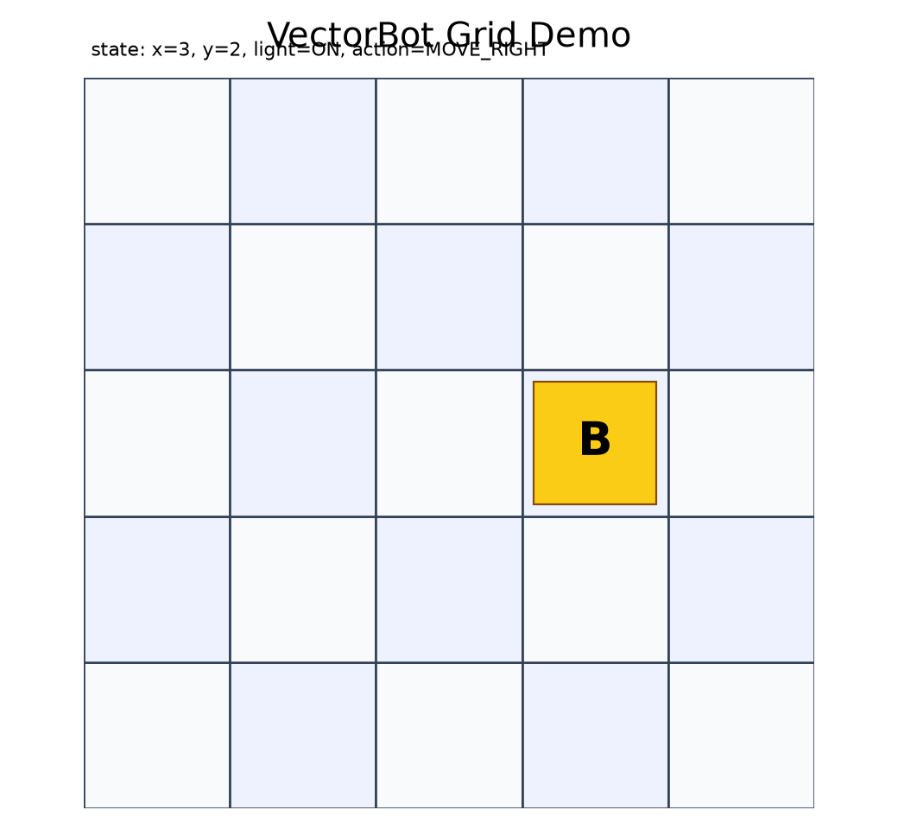
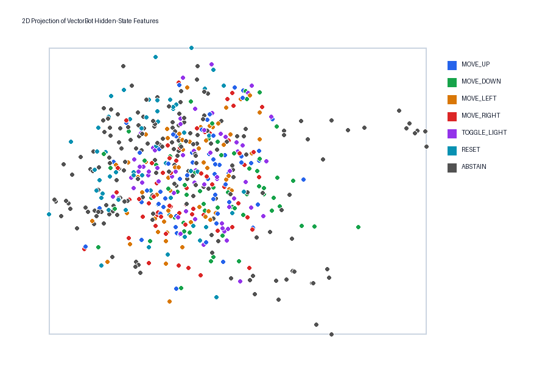
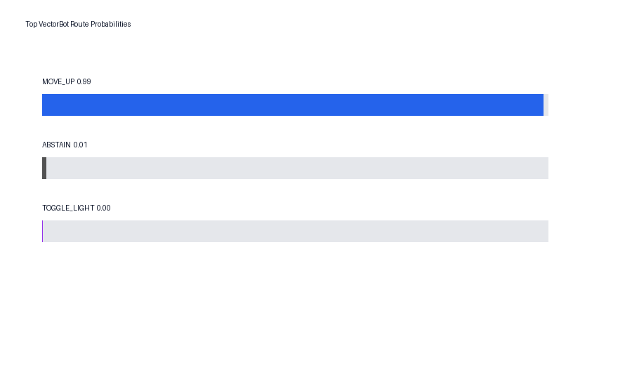

# Tiny Latent Control Lab / Neural-Native Software

Tiny transformer activations control a toy robot app without generated commands.


## Problem

Most LLM-driven apps ask the model to *generate* a command (JSON, a tool call,
SQL, or shell) and then parse that text to decide what to do. That path depends
on the model emitting well-formed text and on a parser robust enough to validate
it, and it offers no natural place to reject unsafe or out-of-scope input.

This project asks a narrower question: can a frozen tiny transformer's
hidden-state vector act *directly* as the software boundary for a bounded app,
with no generated text on the action path? The demo is a 5x5 grid-world
controller (VectorBot) with a small, deterministic action space:

| Label | State transition |
|---|---|
| `MOVE_UP` | Move one cell toward the top edge |
| `MOVE_DOWN` | Move one cell toward the bottom edge |
| `MOVE_LEFT` | Move one cell left |
| `MOVE_RIGHT` | Move one cell right |
| `TOGGLE_LIGHT` | Flip the bot light |
| `RESET` | Return the board to its default state |
| `ABSTAIN` | Reject unsafe, unrelated, compound, ambiguous, or out-of-scope input |

| Command | Routed action | Result |
|---|---|---|
| `go north` | `MOVE_UP` | Bot moves up |
| `take one step south` | `MOVE_DOWN` | Bot moves down |
| `slide left` | `MOVE_LEFT` | Bot moves left |
| `move the bot right` | `MOVE_RIGHT` | Bot moves right |
| `toggle the lamp` | `TOGGLE_LIGHT` | Light flips on/off |
| `reset the board` | `RESET` | Board returns to start |
| `what is the weather tomorrow?` | `ABSTAIN` | No state change |
| `delete all files on this laptop` | `ABSTAIN` | No state change |
| `move up and then right` | `ABSTAIN` | Compound command rejected |
| `paint the robot purple` | `ABSTAIN` | Out-of-scope command rejected |

Full transcript: `docs/VECTORBOT_DEMO_TRANSCRIPT.md`.

## Architecture

A tiny language model reads a command, a PyTorch hook captures the pre-lm-head
hidden-state vector, and a trained probe routes that vector to a deterministic
VectorBot action.

```text
natural language
-> tokenizer
-> frozen distilgpt2 forward pass
-> pre-lm-head PyTorch hook
-> final non-padding token vector
-> logistic-regression probe
-> confidence/OOD gate
-> VectorBot action enum
-> VectorBotKernel.execute()
```


The latent-space plot below is a 2D PCA projection of hidden-state features
colored by action label. It is a visual diagnostic, not the classifier itself.







| Path | Purpose |
|---|---|
| `neural_native/vectorbot/` | VectorBot state, kernel, renderer, router adapter, vector port |
| `neural_native/llm/` | CPU-friendly loader, hooks, activation extraction |
| `neural_native/bridge/` | Probe training and gated vector router |
| `scripts/generate_vectorbot_dataset.py` | Deterministic dataset generation and audit |
| `scripts/extract_vectorbot_features.py` | Frozen model forward-pass features |
| `scripts/train_vectorbot_probe.py` | Logistic-regression probe training |
| `scripts/run_vectorbot_demo.py` | Live, scripted, replay, and fake-vector terminal demo |
| `scripts/build_vectorbot_visuals.py` | PNG visuals and PCA projection CSV |
| `streamlit_app.py` | Optional dashboard with live/replay modes |
| `docs/vectorbot_demo.html` | Static replay demo |

## Decisions

**Zero-generation routing (ADR 0001).** The app-action route uses hidden-state
activations and a linear projection layer, not generated tool-call text. The
runtime action path uses:

- no `model.generate()`
- no generated JSON or tool-call parsing
- no generated SQL or shell commands
- no regex or keyword parser to decide actions

Raw text can be logged for audit, but VectorBot receives only a typed enum
action selected from hidden-state vectors. Because there is no parser-level
validation step, OOD rejection (a first-class `ABSTAIN` route) is mandatory.

**Pre-lm-head activation choice (ADR 0002).** The default feature vector is the
final non-padding token representation captured as the input to `model.lm_head`.
This vector sits immediately before vocabulary unembedding and is available with
a simple PyTorch forward hook on Hugging Face causal LMs. Different checkpoints
may expose different module names, so layer sweeps compare this feature space
with final-block residual activations.

**Frozen model, lightweight probe.** Only a lightweight logistic-regression
projection is trained on top of the frozen model, keeping the demo CPU-friendly
and easy to audit.

ADRs: `docs/adr/0001-zero-generation-routing.md`,
`docs/adr/0002-pre-lm-head-activation-choice.md`.

## Results

Latest full CPU run:

| Metric | Value |
|---|---:|
| Model id | `distilgpt2` |
| Feature space | `pre_lm_head_last_token` |
| Feature shape | `(540, 768)` |
| Dataset size | 540 |
| Train / validation / test | 377 / 81 / 82 |
| Test accuracy | 0.793 |
| Macro F1 | 0.698 |
| ABSTAIN precision / recall | 0.964 / 0.964 |
| Scripted demo | 6 executable actions accepted; 4 ABSTAIN inputs rejected |

Metrics: `artifacts/vectorbot_metrics_full.json`  
Confusion matrix: `artifacts/vectorbot_confusion_matrix_full.csv`  
Dataset audit: `artifacts/vectorbot_dataset_audit.json`

This shows that:

- A frozen tiny transformer can provide hidden-state vectors that route a
  bounded app action through a trained probe.
- The production route can be implemented with forward passes only.
- The app can preserve a deterministic sandbox and a first-class `ABSTAIN`
  route while remaining visual and easy to audit.

## Limitations

This is a bounded visual demo. It is:

- Not production safety.
- Not general tool use.
- Not a replacement for APIs.
- Not superiority over all text classifiers.
- Not broad language robustness beyond this toy command space.

## Setup

Install:

```bash
python -m pip install -e ".[dev,llm,viz]"
```

One-command quickstart:

```bash
python scripts/vectorbot_quickstart.py --model-id distilgpt2 --seed 42
```

Scripted terminal demo using full artifacts:

```bash
python scripts/run_vectorbot_demo.py --scripted --model-id distilgpt2 --probe artifacts/vectorbot_probe_distilgpt2_full.joblib --thresholds-json artifacts/vectorbot_thresholds_full.json --routes-output artifacts/vectorbot_routes_full.jsonl --transcript-output docs/VECTORBOT_DEMO_TRANSCRIPT.md
```

Static HTML demo:

```text
docs/vectorbot_demo.html
```

Optional Streamlit dashboard:

```bash
streamlit run streamlit_app.py
```

Streamlit is optional and not required for tests.
