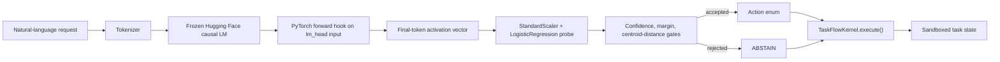
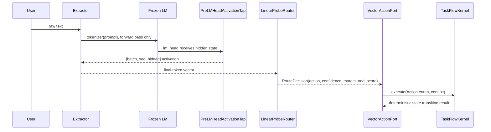

# Architecture

The production inference path is intentionally narrow:

```text
Text -> tokenizer -> frozen LLM forward pass -> pre_lm_head hook -> vector -> linear probe -> OOD gate -> typed action -> TaskFlowKernel
```

## System Diagram



## Sequence Diagram



## Pre-lm_head Activation Capture

`PreLMHeadActivationTap` registers a PyTorch forward hook on `model.lm_head` and
stores `inputs[0]`, the hidden state consumed by the unembedding layer. The
extractor selects the final non-padding token for each prompt, producing one
vector per user request.

The extractor uses:

```text
model(**encoded_inputs, use_cache=False)
```

It does not call `model.generate()`.

## Projection Layer

The MVP trains a lightweight scikit-learn probe:

```text
StandardScaler -> LogisticRegression
```

The base language model remains frozen. The only trained parameters are the
probe/projection layer. The serialized probe bundle records model id, prompt
template, feature space, label classes, centroids, split metrics, and recommended
thresholds.

## OOD Gating

Routing is accepted only when:

- the predicted class is not `ABSTAIN`,
- max class probability clears `min_confidence`,
- top-1/top-2 probability margin clears `min_margin`,
- predicted-class centroid distance is below `max_centroid_distance` when set.

The evaluator additionally reports ABSTAIN-vs-executable AUROC for max
probability, margin, and nearest executable centroid distance.

## Why This Avoids API Parsing

The app never consumes generated commands. Raw text is used only as input to the
tokenizer and as audit metadata in task records. Action selection happens from a
frozen hidden-state vector through a probe and gate, then dispatches a typed
`Action` enum to `TaskFlowKernel.execute()`.

Forbidden surfaces remain outside the toy app:

- no generated JSON/tool calls,
- no generated SQL or shell,
- no regex, keyword matching, or text parser for action choice,
- no arbitrary filesystem, network, or OS-control actions.

## Limitations

- The checked-in dataset is synthetic and small.
- `ABSTAIN` is trained as a class; it is not a complete open-world OOD solution.
- The `distilgpt2` run proves the real-model path locally, while Gemma is the
  richer portfolio target for GPU/Colab.
- Linear probes demonstrate separability but are not calibrated production
  policies.
- The app kernel is intentionally a bounded deterministic task state machine.
